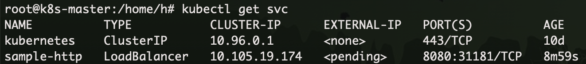
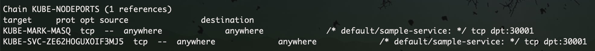
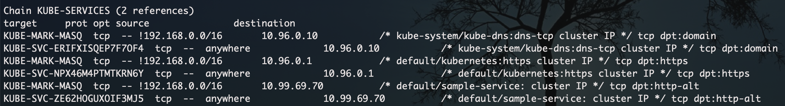
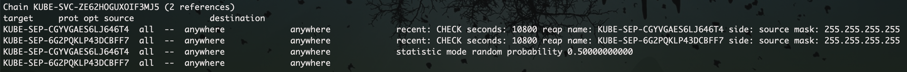
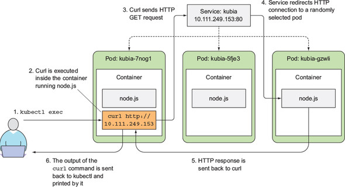
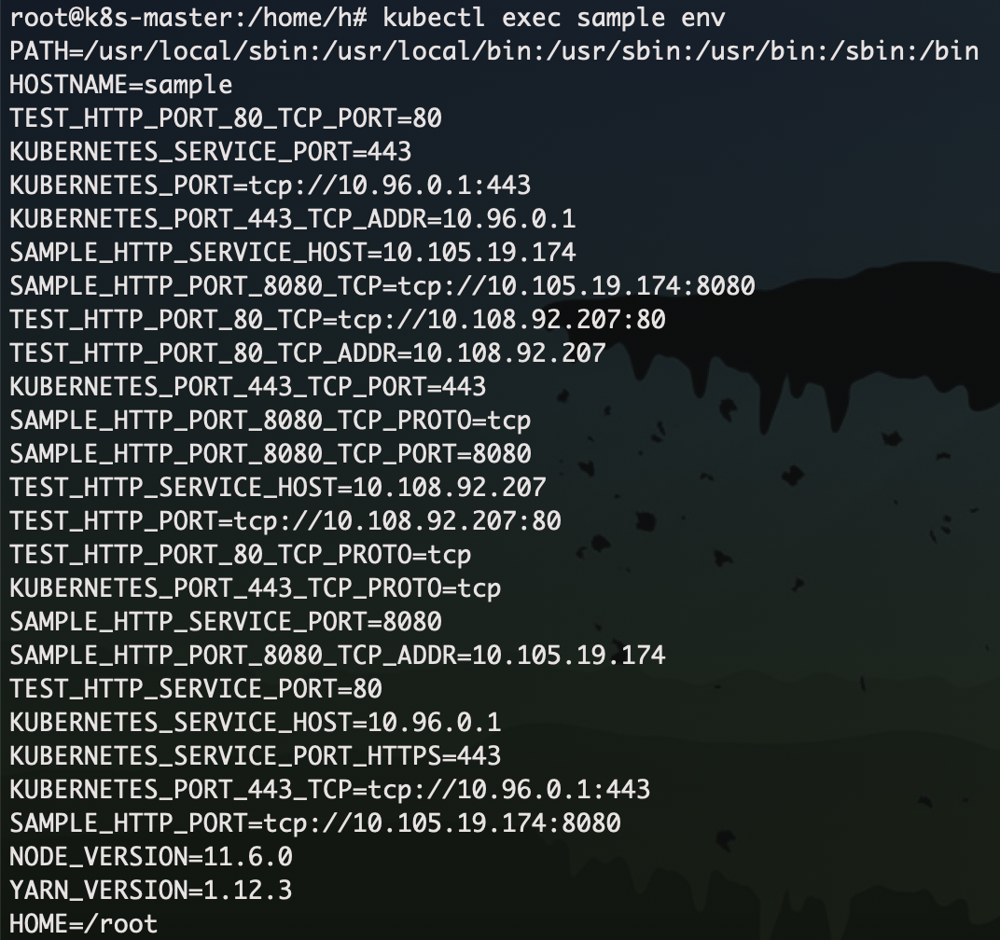
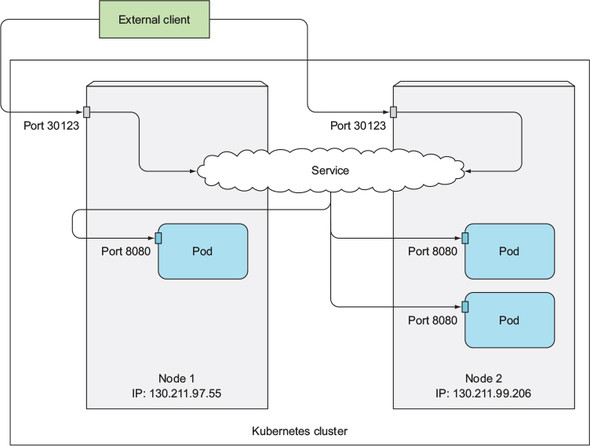
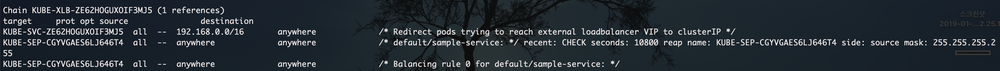
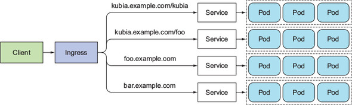
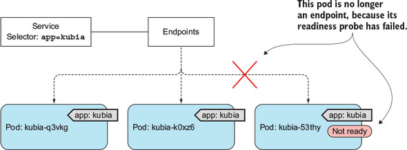

<!-- $theme: gaia -->
<!-- template: invert -->
<!-- page_number:true -->
<!-- $size: 16:9 -->

# Chapter 05 
# 서비스

-----------------------------------------

## 서비스가 필요한 이유

* 포드는 일회성
* scale, failure 등의 이유로 노드간 이동이 발생
* 포드가 노드에 할당된 후 시작하기 전에 IP를 할당
* 클라이언트에서 서버의 IP를 알 수 없음

  

## 서비스?

* 동일한 서비스를 제공하는 Pod 그룹에 대한 단일 진입 지점
* 서비스가 존재하는 동안 변경되지 않는 IP 주소와 Port를 가짐
* 해당 서비스와 연결된 Pod 중 하나로 전달

-----------------------------------------

-----------------------------------------

## 서비스 생성

~~~
apiVersion: v1
kind: Service
metadata:
  svc: sample
spec:
  ports:
    - port: 8080
      targetPort: 8080
  selector:
    svc: sample
~~~

~~~
$ kubectl expose pod sample --type=LoadBalancer --name sample-http \
  --port=8080 --target-port=8080 --selector='svc=sample'
~~~

-----------------------------------------

## 서비스의 실체..?

* KUBE-NODEPORTS chain

* KUBE-SERVICES chain

* KUBE-SVC-? chain

--------------------------------------

## 컨테이너에 명령 실행

-----------------------------------------

## 서비스의 Session Affinity 구성

~~~
spec:
  sessionAffinity: ClientIP
~~~

~~~
$kubectl expose pod sample --type=LoadBalancer --name sample-http \
  --session-affinity=ClientIP'
~~~

 

* 고정 세션을 구성
* Sticky Session
* None, ClientIP 타입만 지원
* Srouce IP 기반 고정 세션을 구현 (by netfilter)

-----------------------------------------

## 서비스 검색

* 환경변수를 이용한 서비스 조회

-----------------------------------------

## 서비스 검색

* DNS & FQDN을 이용한 서비스 검색

~~~
root@sample-test:/ $ curl -XGET 'http://sample-http:8080'
~~~

~~~
root@sample-test:/ $ curl -XGET 'http://sample-http.default.svc:8080'
~~~

-----------------------------------------

## 클러스터 외부 서비스 연결

* k8s 바깥의 서비스들을 수동으로 연결 가능
* ExternalName 타입의 서비스는 DNS 레벨에서 구현 (iptables에 관련 룰은 없음)

-----------------------------------------

## 클러스터 외부 서비스 연결

* k8s 바깥의 서비스들을 수동으로 연결 가능

~~~
apiVersion: v1
kind: Service
metadata:
    name: external-service
spec:
    type: ExternalName
    externalName: external.com
    ports:
        - port: 1234
~~~

~~~
apiVersion: v1
kind: Endpoints
metadata:
  name: external-service
subsets:
  - addresses:
    - ip: 10.0.2.21
    - ip: 10.0.2.22
    ports:
      - port: 1234
~~~

-----------------------------------------

## 외부 클라이언트

* NodePort 타입의 서비스를 통해 외부 클라이언트에서 접근 할 수 있도록 해줌

~~~
apiVersion: v1
kind: Service
metadata:
  name: sample-http
spec:
  type: NodePort
  ports:
  - port: 8080
    targetPort: 8080
    nodePort: 30123
  selector:
    svc: sample
~~~

-----------------------------------------

## 외부 클라이언트

-----------------------------------------

## 외부 로드 밸런서를 이용한 노출

-----------------------------------------

## 외부 연결의 특성

* 불필요한 네트워크 홉의 방지

~~~
spec:
	externalTrafficPolicy: Local
~~~

-----------------------------------------

## 외부 연결의 특성

* KUBE-NODEPORTS Chain (worker node 전체 공통)

* KUBE-XLB Chain (worker node 별로 룰이 달라짐)
* 해당 노드에 전달할 pod가 없는 경우

* 해당 노드에 전달할 pod가 있는 경우

-----------------------------------------

## 인그레스

* install
~~~
$ kubectl apply -f \
  https://raw.githubusercontent.com/kubernetes/ingress-nginx/master/deploy/mandatory.yaml
$ kubectl apply -f \
  https://raw.githubusercontent.com/kubernetes/ingress-nginx/master/deploy/provider/cloud-generic.yaml
~~~

-----------------------------------------

## 인그레스

~~~
apiVersion: extensions/v1beta1
kind: Ingress
metadata:
  name: sample-ingress
spec:
  rules:
  - http:
      paths:
      - path: /sample
        backend:
          serviceName: sample-service
          servicePort: 8080
~~~

-----------------------------------------

## 인그레스

-----------------------------------------

## Readness Probe

* Exec, Http Get, Tcp 타입 사용 가능

-----------------------------------------

## Readness Probe

~~~
apiVersion: v1
kind: ReplicationController
...
spec:
  ...
  template:
    ...
    spec:
      containers:
      - name: kubia
        image: luksa/kubia
        readinessProbe:
          exec:
            command:
            - ls
            - /var/ready
        ...
~~~

-----------------------------------------

## Headless Service

* 각 개별 pod의 ip를 전부 얻어오기 위한 서비스
* CluterIP를 None으로 설정하면 DNS 서버는 단일 서비스 IP 대신 pod의 ip 목록을 전달
* 준비 된 Pod의 목록만 전달 (default)

~~~
apiVersion: v1
kind: Service
metadata:
    name: sample-headless-service
spec:
    clusterIP: None
    ports:
    - port: 8080
      targetPort: 8080
    selector:
        svc: sample
~~~

-----------------------------------------

## Headless Service

* 준비되지 않은 모든 pod를 찾으려면 아래 주석을 추가

~~~
metadata:
    name: sample-headless-service
    annotations:
        service.alpha.kubernetes.io/tolerate-unready-endpoints: "true"
...
~~~

