<!-- $theme: gaia -->
<!-- template: invert -->
<!-- page_number:true -->
<!-- $size: 16:9 -->

# Chapter 11
# 쿠버네티스 내부

-----------------------------------------

<div style="font-size:75%">

## 아키텍처 이해

* Kubernetes Control Plane
	* etcd Distributed Storage
	* API Server
	* scheduler
	* control manager
* Worker Nodes
	* Kubelet
	* Kubernetes Service Proxy (kube-proxy)
	* container runtime

</div>

-----------------------------------------

<div style="font-size:75%">

## 아키텍처 이해

* Add-On Components
	* Kubernetes DNS Server
	* Dashboard
	* Ingress Controller
	* Heapster
	* Container Network Interface Plugin (CNI)

</div>

-----------------------------------------

<div style="font-size:75%">
  
## 컴포넌트간 상호 종속성

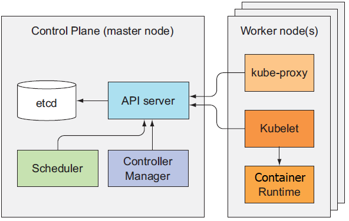

</div>

--------------------------------------

<div style="font-size:75%">
  
## 컴포넌트의 상태 확인
  

~~~
kubectl get componentstatuses
NAME                 STATUS    MESSAGE              ERROR
scheduler            Healthy   ok
controller-manager   Healthy   ok
etcd-0               Healthy   {"health": "true"}
~~~

</br></br>

## 컴포넌트와 커뮤니케이션 하는 방법

* API Server와만 통신
* 거의 항상 컴포넌트가 API Server로 요청
* kubectl attach, kubectl port-forward 등의 일부 경우에만 API Server가 kubelet에 먼저 연결을 시도

</div>

-----------------------------------------

<div style="font-size:75%">

## 컴포넌트의 고가용성

* Control Plane
	* etcd는 Clustering
	* API Server는 Multi-Active
	* Control Manager, Scheduler는 Active-Standby
* Worker Nodes
	* 전체 컴포넌트가 각각의  Worker Node에서 실행

</div>

-----------------------------------------

<div style="font-size:75%">

## 쿠버네티스와 etcd

* 모든 오브젝트(Pod, RC, Service 등..)는 API Server가 재시작되거나 실패하더라도 유지되거나 복원되기 위해 영구적으로 저장되어야 함.
* Distributed Key-Value Storage인 etcd에 저장.
* API Server외의 컴포넌트는 API Server를 통해 간접적으로 etcd에 접근

</br>

## 쿠버네티스와 API Server를 통해 etcd에 읽고 쓰는 이유

* 저장소 추상화
* 유효성 검사
* 낙관적(Optimistic) Tx (metadata.resourceVersion)

</div>

-----------------------------------------

<div style="font-size:75%">

## etcd에 리소스를 저장하는 방법

~~~
$ export ETCDCTL_API=3
$ etcdctl --endpoints https://127.0.0.1:2379 \
   --cacert /etc/kubernetes/pki/etcd/ca.crt \
   --cert /etc/kubernetes/pki/etcd/server.crt \
   --key /etc/kubernetes/pki/etcd/server.key \
   get / --prefix=true --keys-only

/registry/configmaps
/registry/daemonsets
/registry/deployments
/registry/event
/registry/namespaces
/registry/pods
...
~~~

* /registry/{objectType}/{namespace}/{objectName}

</div>

-----------------------------------------

<div style="font-size:75%">

## etcd 클러스터

* Quorum 유지를 통한 분산된 etcd 클러스터의 일관성
	* 여러 사람의 합의로 운영되는 의사기관에서 의결을 하는데 필요한 최소한의 참석자 수
* RAFT Consensus Algorithm (http://swalloow.github.io/raft-consensus)
* split-brain 방지를 위해 홀수 권장

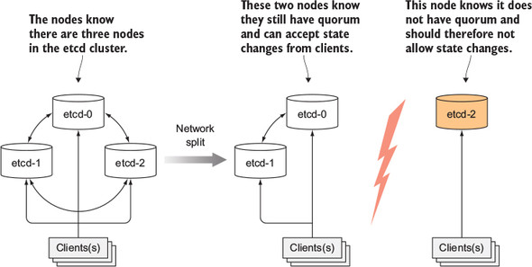

</div>

-----------------------------------------

<div style="font-size:75%">

## API 서버가 하는 일

* 클러스터 상태를 조회 및 수정할 수 있는 인터페이스 제공.
* 변경된 상태를 etcd에 저장.
* object의 유효성 검사.
* Optimistic Locking 처리

</div>

-----------------------------------------

<div style="font-size:75%">

## API 서버의 동작

* 인증 플러그인 - 클라이언트 인증
* 권한 승인 플러그인 - 클라이언트 권한 승인
* 승인 제어 플러그인 - 요청 받은 리소스를 조회 및 수정
* resource validation - 리소스의 검증 및 저장


</div>

-----------------------------------------

<div style="font-size:75%">

## API 서버가 리소스 변경을 통지하는 방법

* API 서버는 etcd의 watch api를 이용하여 subscribe
* API 서버에 리소스 변경 요청이 오면 해당 요청을 etcd에 저장.
* etcd에서 변경이 일어난 key를 publish
* notification을 받은 API 서버는 watch api를 요청한 클라이언트에 notify
* http1.0 : 응답의 일부만 전달해주어 connection을 유지함.
* http1.1 : Chunked Streaming 방식으로 구현 
* Why not implement it as http2?


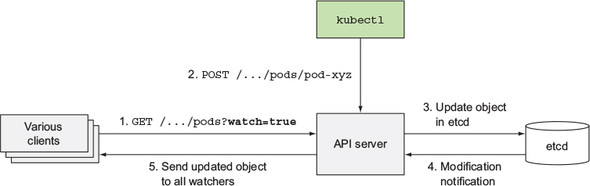

</div>

-----------------------------------------

<div style="font-size:75%">

## API 서버가 리소스 변경을 통지하는 방법

```
$ vi /etc/kubernetes/manifests/kube-apiserver.yaml
$ systemctl restart kubelet

apiVersion: v1
kind: Pod
metadata:
  ...
spec:
  containers:
  - command:
    ...
    - --insecure-port=8080
```

```
$ curl --http1.0 http://localhost:8080/api/v1/pods?watch=true

$ curl http://localhost:8080/api/v1/pods?watch=true
```


</div>

-----------------------------------------

<div style="font-size:75%">

## API 서버가 리소스 변경을 통지하는 방법

* http1.1
```
$ tcpdump -nlA -i lo port 8080
05:33:24.628863 IP 127.0.0.1.44242 > 127.0.0.1.8080: Flags [P.], seq 1:101, ack 1, win 342, options [nop,nop,TS val 925974024 ecr 925974024], length 100: HTTP: GET /api/v1/pods?watch=true HTTP/1.1
E....w@.@.o..............Q..jn.....V.......
71>.71>.GET /api/v1/pods?watch=true HTTP/1.1
Host: localhost:8080
User-Agent: curl/7.58.0
Accept: */*
05:33:24.629526 IP 127.0.0.1.8080 > 127.0.0.1.44242: Flags [P.], seq 1:117, ack 101, win 342, options [nop,nop,TS val 925974025 ecr 925974024], length 116: HTTP: HTTP/1.1 200 OK
E...;_@.@...............jn...Q.=...V.......
71>	71>.HTTP/1.1 200 OK
Content-Type: application/json
Date: Fri, 22 Mar 2019 05:33:24 GMT
Transfer-Encoding: chunked
9cf
{"type":"ADDED","object":{ ... }}
19a2
{"type":"ADDED","object":{ ... }}
aab
{"type":"MODIFIED","object":{ ... }}
....
```

</div>

-----------------------------------------

<div style="font-size:75%">

## API 서버가 리소스 변경을 통지하는 방법

* http1.0
```
$ tcpdump -nlA -i lo port 8080

05:42:32.087199 IP 127.0.0.1.47318 > 127.0.0.1.8080: Flags [P.], seq 1:101, ack 1, win 342, options [nop,nop,TS val 926521512 ecr 926521512], length 100: HTTP: GET /api/v1/pods?watch=true HTTP/1.0
E...9<@.@.."............rC.u...,...V.......
79..79..GET /api/v1/pods?watch=true HTTP/1.0
Host: localhost:8080
User-Agent: curl/7.58.0
Accept: */*

05:42:32.087785 IP 127.0.0.1.8080 > 127.0.0.1.47318: Flags [P.], seq 1:89, ack 101, win 342, options [nop,nop,TS val 926521513 ecr 926521512], length 88: HTTP: HTTP/1.0 200 OK
E...`c@.@..................,rC.....V.......
79..79..HTTP/1.0 200 OK
Content-Type: application/json
Date: Fri, 22 Mar 2019 05:42:32 GMT

05:42:32.090370 IP 127.0.0.1.8080 > 127.0.0.1.47318: Flags [P.], seq 56470:60566, ack 101, win 342, options [nop,nop,TS val 926521516 ecr 926521515], length 4096: HTTP
{"type":"ADDED", ... "oper
...
```

</div>

-----------------------------------------

<div style="font-size:75%">

## Scheduler의 이해

* pod이 생성되고, node에 할당되지 않았을 때 scheduler가 특정 노드에 pod을 할당 (api-server를 통해 resource만 update)
* pod이 update되면 (pod이 node에 할당되면) 해당 노드의 kubelet이 실제 pod을 생성

</div>

-----------------------------------------

<div style="font-size:75%">

## 기본 스케줄링

* pod이 schedule될 수 있는 노드의 목록을 필터링
* 허용하는 노드 중 우선순위로 정렬하고 최적의 노드를 선택한다

</br>

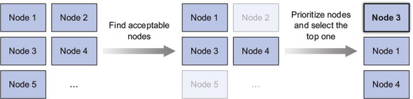

</div>

-----------------------------------------

<div style="font-size:75%">

## 수용 가능한 노드 찾기

* node가 pod를 호스팅할 수 있으려면 아래의 사항들을 통과해야 함

	* node가 pod의 request resource 이상의 여분이 있는가?
	* node에 리소스가 부족한가?
	* node가 pod 스펙의 노드 셀렉터에 맞는 라벨을 가졌는가?
	* pod이 특정 호스트 포트에 바인딩을 요청하는 경우 해당 node에 포트가 이미 사용되고 있는가?
	* pod이 특정 볼륨 유형을 요청하는 경우, 이 볼륨을 node의 pod에 마운트할 수 있는가?
	* pod는 node의 taints를 허용하는가?

</div>

-----------------------------------------

<div style="font-size:75%">
  
## Controller 소개

* API 서버는 Resource를 etcd에 저장하고 변경 사항을 통지하기만 함.
* 변경 사항 반영은 Controller Manager에서 실행되는 Controller가 수행.

</br>

## Controller가 하는 일과 동작 방식

* API 서버를 통해 리소스의 변경을 감시하고, 오브젝트의 생성, 갱신, 삭제 등의 동작을 수행.
* 실제 상태를 원하는 상태로 변경을 시도.
* 변경 된 실제 상태를 Resource의 Status 필드에 반영.
* Controller 간에는 직접 통신하지 않음.
* Controller는 Kubelet과 직접 통신하지 않음.

</div>

-----------------------------------------

<div style="font-size:75%">
  
### Replication Manager, ReplicaSet Controller

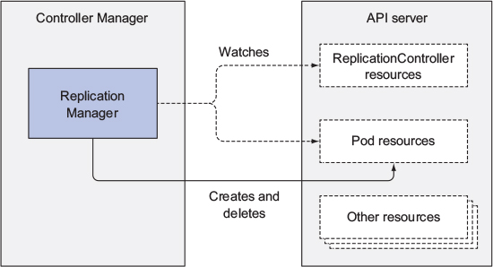

</div>

-----------------------------------------

<div style="font-size:75%">
  
### DaemonSet, Job Controller

* Pod Resource를 각 Resource에 정의된 Pod Template으로 생성.
* Pod 정의를 API 서버로 전달하여 Kubelet이 Container를 생성하고 실행하게 만듬.

</br>

### Deployment Controller

* API 서버에 저장 된 오브젝트와 동기를 맞추기 위해 실제 Deployment 상태를 유지 관리.
* Deployment Object가 변경될 때 마다 새로운 버전으로 Roll-Out.

</br>

### StatefulSet Controller

* StatefulSet Resource의 Spec에 따라 Pod를 생성, 관리, 삭제.
* 각 Pod Instance의 PersistentVolumeClaim을 인스턴스화 하고 관리.

</div>

-----------------------------------------

<div style="font-size:75%">

### Node Controller

* Cluster의 Node Resource를 관리
* API 서버에서의 Resource 이름은 Nodes, etcd에서의 Key 이름은 minions

### Service Controller

* LoadBalancer Type의 Service가 생성되면 인프라스트럭처로 LoadBalancer를 요청.

</div>

-----------------------------------------

<div style="font-size:75%">

### Endpoint Controller

* Service, Pod, Endpoint Resource를 모두 감시
* Service의 label selector와 매칭되는 pod의 ip와 port를 찾아 Endpoint Resource를 최신 상태로 유지

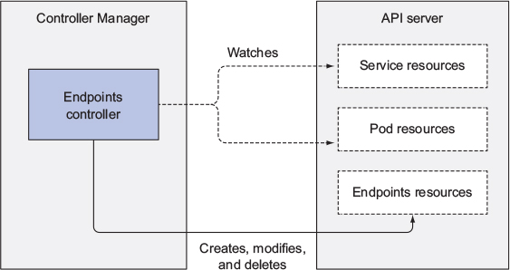

</div>

-----------------------------------------

<div style="font-size:75%">

### Namespace Controller

* Namespace Resource가 제거될 때 해당 Namespace에 속한 모든 Resource를 제거.

</br>

### PersistentVolume Controller

* PersistentVolumeClaim이 생성되면 적절한 PersistentVolume을 찾아 Binding.

</div>

-----------------------------------------

<div style="font-size:75%">

## Kubelet

* Worker Node에서 실행되는 모든 것에 책임을 가짐.
* 초기 실행 시 Kubelet이 실행되는 Host를 Node Resource로 등록.
* 해당 Node에 Schedule된 Pod을 모니터링하여 Pod의 Container를 실행.
* 실행 중인 Container를 지속적으로 모니터링하고 상태와 이벤트, 리소스 소모를 API 서버에 통지.
* readness, liveness probe를 실행하는 컴포넌트.
* Pod Resource가 삭제됐을 때 Container를 중지하고 완전히 중지되면 API 서버에 통지.

</div>

-----------------------------------------

<div style="font-size:75%">
  
## Kubelet

* 특정 local directory의 manifests 파일 기반으로 Pod 생성 가능
* Control Plane Pods (ex. kube-apiserver, kube-control-manager ... )
```
$ ls /etc/kubernetes/manifests
etcd.yaml  kube-apiserver.yaml  kube-controller-manager.yaml  kube-scheduler.yaml
```

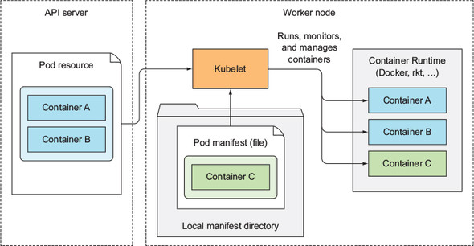

</div>

-----------------------------------------

<div style="font-size:75%">

## Kubernetes Proxy

* 모든 Worker Node는 kube-proxy를 실행.
* Service Object로 Client가 연결할 수 있도록 하는 것이 목적.
* Service가 둘 이상의 Pod으로 연결되면 해당 노드에서 LoadBalancing을 수행.
* 초기 버전의 구현은 iptables의 userspace redirect를 이용하여 구현.
* 현재는 일반적인 iptables의 Rule로 구현.

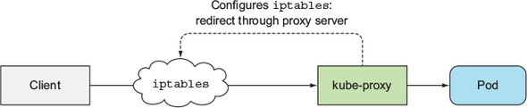

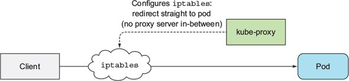

</div>

-----------------------------------------

<div style="font-size:75%">
  
## Kubernetes Add-On

* DNS, Ingress, Web Dashboard 등.
* Yaml Manifests를 통해 Pod처럼 배포.
* Deployments, ReplicationSet/Controller, DaemonSet의 형태로 배포.

</div>

-----------------------------------------

<div style="font-size:75%">

## DNS 서버

* Kubernetes Cluster의 모든 Pod은 내부 DNS 서버를 사용하도록 구성하는 것이 기본.
* Cluster에 배포되는 모든 Container 내부의 /etc/resolv.conf 파일에 nameserver로 등록
```
$ root@k8s-master:/home/h# kubectl exec -it sample cat /etc/resolv.conf
nameserver 10.96.0.10
search default.svc.k8s svc.k8s k8s
options ndots:5
```
* API 서버의 watch interface를 이용하여 Pod, Service, Endpoints의 변화를 관찰
* 최신의 DNS 정보를 유지.
* Resource가 갱신될 때 watch interface를 통해 통지 받는 사이 잠시동안 DNS Record가 유효하지 않을 수 있음.

</div>

-----------------------------------------

<div style="font-size:75%">

## Ingress Controller

* Nginx등의 Reverse Proxy를 실행.
* Ingress, Service, Endpoint Resource를 감시하여 구성.
* Ingress Resource의 정의가 서비스를 가리키고 있지만 Ingress는 Service IP 대신 직접 Pod로 트래픽을 전달.
</br>
* curl -XGET 'http://service:8080'

```
$ root@k8s-worker1:/home/h# tcpdump -i calib43f921251f
03:08:19.315423 IP 192.168.0.1.60378 > 192.168.1.40.http-alt: Flags [P.], seq 1:83, ack 1, win 229, options [nop,nop,TS val 3164462534 ecr 3348765433], length 82: HTTP: GET / HTTP/1.1
03:08:19.315760 IP 192.168.1.40.http-alt > 192.168.0.1.60378: Flags [P.], seq 1:143, ack 83, win 227, options [nop,nop,TS val 3348765434 ecr 3164462534], length 142: HTTP: HTTP/1.1 200 OK
```

* curl -XGET 'https://ingress/sample'
```
$ root@k8s-worker1:/home/h# tcpdump -i calib43f921251f
03:04:09.025471 IP 192.168.1.38.44304 > 192.168.1.40.http-alt: Flags [P.], seq 1:310, ack 1, win 229, options [nop,nop,TS val 2177334759 ecr 1588388826], length 309: HTTP: GET /sample HTTP/1.1
03:04:09.025669 IP 192.168.1.40.http-alt > 192.168.1.38.44304: Flags [P.], seq 1:143, ack 310, win 235, options [nop,nop,TS val 1588388827 ecr 2177334759], length 142: HTTP: HTTP/1.1 200 OK
```

</div>

-----------------------------------------

<div style="font-size:75%">

## Controller의 상호 협력 방식

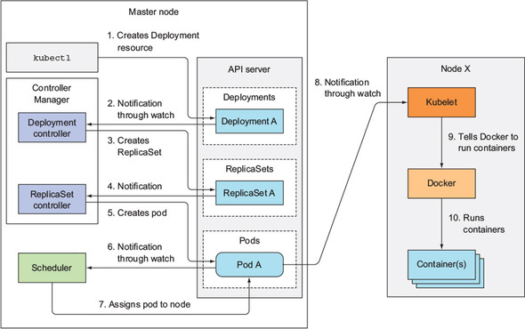

</div>

-----------------------------------------

<div style="font-size:75%">
  
## 실행 중인 Pod의 이해

* Pod이 배포되면 항상 /pause를 실행하는 Pod Infra Container가 같이 배포.
* Pod이 배포되면 Pod Infra Container가 먼저 실행되고 해당 Container가 하나의 namespace를 점유.
* Pod 내의 다른 Container는 Pod Infra Container의 namespace를 공유하여 사용 (https://www.ianlewis.org/en/almighty-pause-container).

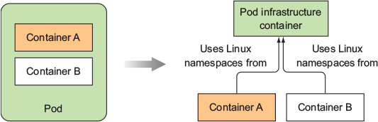

</div>

-----------------------------------------

<div style="font-size:75%">
  
## Inter-Pod Networking

* Pod간 Networking은 CNI(Cloud Network Interface) Plug-In에 의해 수행.
* 상세한 구현 방식은 CNI별로 상이함.
* Pod이 어떤 Node에 있건 관계없이 통신할 수 있어야 함.
* Pod가 통신하는 데 사용하는 IP 주소는 변환되지 않아야 함(no NAT).
* 이는 하나의 스위치에 연결 된 것처럼 간단하고 정확하게 통신 가능하도록 만듬 (Fabric).
* Pod to Node, Node to Pod간의 통신에는 SNAT를 사용.

</div>

-----------------------------------------

<div style="font-size:75%">

## Inter-Pod Networking

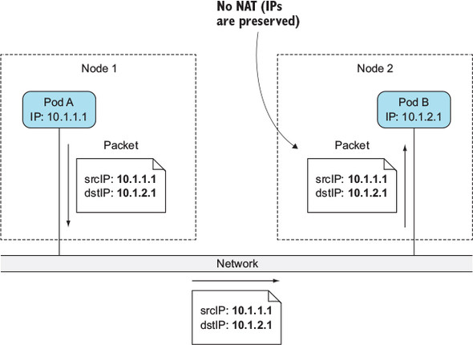

</div>

-----------------------------------------

<div style="font-size:75%">

## 동일한 노드 상의 Pod간의 통신

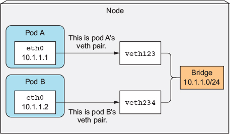

</div>

-----------------------------------------

<div style="font-size:75%">
  
## 동일한 Node 상의 Pod간의 통신

* Pod Infra Container가 실행되기 전 veth 쌍을 생성.
* 하나는 Pod의 Namespace 내에, 하나는 Host의 Namespace 내에 생성.
* Node 내의 모든 Container는 동일한 Bridge에 연결되므로 서로 통신이 가능.
</br>

```
$ ifconfig
cali0f45f098f23: flags=4163<UP,BROADCAST,RUNNING,MULTICAST>  mtu 1500
cali60876d4f815: flags=4163<UP,BROADCAST,RUNNING,MULTICAST>  mtu 1500
```

```
$ ip route
...
192.168.0.43 dev cali0f45f098f23 scope link
192.168.0.44 dev cali6a5876e6908 scope link
192.168.0.45 dev cali60876d4f815 scope link
...
```

</div>

-----------------------------------------

<div style="font-size:75%">

## 서로 다른 Node 상의 Pod간의 통신

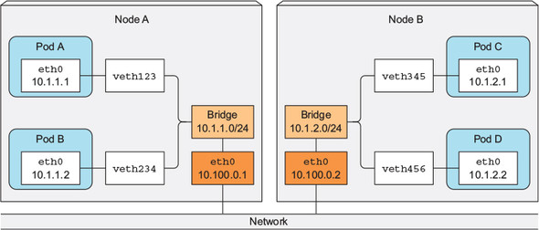

</div>

-----------------------------------------

<div style="font-size:75%">

## 서로 다른 Node 상의 Pod간의 통신

* Pod의 IP 주소는 클러스터 내에서 유일해야 함.
* Node의 Bridge는 겹치지 않는 주소 범위를 사용.
* Node의 Physical Interface도 Node의 Bridge에 연결 됨.
* Node A의 PodA에서 Node B의 Pod C로 패킷을 보내려면 Node A에서 Node B로 라우팅되도록 라우팅 테이블을 구성해야 함.

```
$ tcpdump -n -i tunl0
04:14:41.984400 IP 192.168.0.45 > 192.168.1.43: ICMP echo request, id 65, seq 85, length 64
04:14:41.984884 IP 192.168.1.43 > 192.168.0.45: ICMP echo reply, id 65, seq 85, length 64
```
```
$ tcpdump -n -i enp0s8 ! port 22
04:13:31.618048 IP 192.168.56.101 > 192.168.56.102: IP 192.168.0.45 > 192.168.1.43: ICMP echo request, id 65, seq 16, length 64 (ipip-proto-4)
04:13:31.618480 IP 192.168.56.102 > 192.168.56.101: IP 192.168.1.43 > 192.168.0.45: ICMP echo reply, id 65, seq 16, length 64 (ipip-proto-4)
```

```
$ ip route
192.168.1.0/24 via 192.168.56.102 dev tunl0 proto bird onlink
192.168.2.0/24 via 192.168.56.103 dev tunl0 proto bird onlink
```

</div>

-----------------------------------------

<div style="font-size:75%">

## Service의 구현

* Service와 관련된 모든 것은 각 노드에서 실행되는 kube-proxy에 의해 처리.
* 각 Service는 고유한 IP와 Port를 얻음.
* Service IP는 가상의 IP.
* Service IP를 물리적으로 갖는 Interface가 없으므로 icmp 요청이 처리되지 않음.
* API 서버에서 Service가 생성되면 가상 IP, Port 쌍이 즉시 할당 됨.
* kube-proxy는 Service Resource의 생성 알람을 받으면 iptables에 규칙을 설정.
* 목적지가 해당 Service인 경우 목적지 주소를 Service와 연결 된 Pod 중 하나로 변경(DNAT)하여 Redirect (Pod to Service).
* Pod 외 (Node, cluster 밖의 client)에서 접근하는 경우 SNAT(Node의 IP), DNAT(Pod의 IP) 모두 필요.

</div>

-----------------------------------------

<div style="font-size:75%">

## Service의 구현

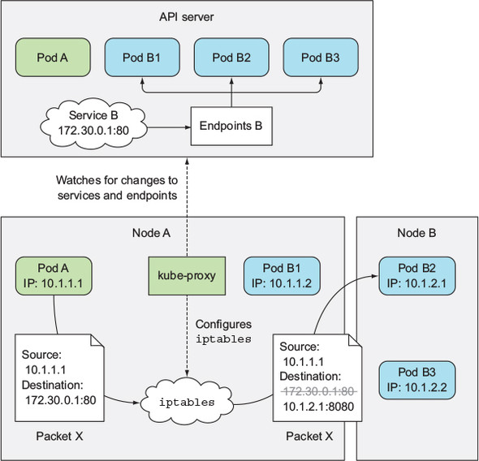

</div>

-----------------------------------------

<div style="font-size:75%">

## Service의 구현

```
$ iptables -L -t nat

Chain PREROUTING (policy ACCEPT)
target     prot opt source               destination
KUBE-SERVICES  all  --  anywhere             anywhere             /* kubernetes service portals */

Chain KUBE-SERVICES (2 references)
target     prot opt source               destination
KUBE-MARK-MASQ  tcp  -- !192.168.0.0/16       10.111.118.28        /* default/sample-service: cluster IP */ tcp dpt:http-alt
KUBE-SVC-ZE62HOGUXOIF3MJ5  tcp  --  anywhere             10.111.118.28        /* default/sample-service: cluster IP */ tcp dpt:http-alt

Chain KUBE-SVC-ZE62HOGUXOIF3MJ5 (2 references)
target     prot opt source               destination
KUBE-SEP-7AE52TSMNDEGV6BO  all  --  anywhere             anywhere             statistic mode random probability 0.50000000000
KUBE-SEP-GEQ73U43LIPSQP2Z  all  --  anywhere             anywhere

Chain KUBE-SEP-7AE52TSMNDEGV6BO (1 references)
target     prot opt source               destination
KUBE-MARK-MASQ  all  --  192.168.1.42         anywhere
DNAT       tcp  --  anywhere             anywhere             tcp to:192.168.1.42:8080

Chain KUBE-SEP-GEQ73U43LIPSQP2Z (1 references)
target     prot opt source               destination
KUBE-MARK-MASQ  all  --  192.168.2.30         anywhere
DNAT       tcp  --  anywhere             anywhere             tcp to:192.168.2.30:8080
```

</div>

-----------------------------------------

<div style="font-size:75%">

## Service의 구현

```
Chain KUBE-MARK-DROP (2 references)
target     prot opt source               destination
MARK       all  --  anywhere             anywhere             MARK or 0x8000

Chain KUBE-MARK-MASQ (18 references)
target     prot opt source               destination
MARK       all  --  anywhere             anywhere             MARK or 0x4000

Chain KUBE-POSTROUTING (1 references)
target     prot opt source               destination
MASQUERADE  all  --  anywhere             anywhere             /* kubernetes service traffic requiring SNAT */ mark match 0x4000/0x4000
```

</div>

-----------------------------------------

<div style="font-size:75%">

### Pod 밖에서 Service로 요청

```
$ tcpdump -i enp0s8 port 30001 -n
05:17:50.632656 IP 192.168.56.1.55824 > 192.168.56.103.30001: Flags [SEW], seq 920096640, win 65535, options [mss 1460,nop,wscale 6,nop,nop,TS val 449946274 ecr 0,sackOK,eol], length 0
05:17:50.632886 IP 192.168.56.103.30001 > 192.168.56.1.55824: Flags [S.E], seq 2034560536, ack 920096641, win 28960, options [mss 1460,sackOK,TS val 167059923 ecr 449946274,nop,wscale 7], length 0
05:17:50.633116 IP 192.168.56.1.55824 > 192.168.56.103.30001: Flags [.], ack 1, win 2058, options [nop,nop,TS val 449946274 ecr 167059923], length 0
05:17:50.633134 IP 192.168.56.1.55824 > 192.168.56.103.30001: Flags [P.], seq 1:85, ack 1, win 2058, options [nop,nop,TS val 449946274 ecr 167059923], length 84
05:17:50.633251 IP 192.168.56.103.30001 > 192.168.56.1.55824: Flags [.], ack 85, win 227, options [nop,nop,TS val 167059923 ecr 449946274], length 0
05:17:50.633746 IP 192.168.56.103.30001 > 192.168.56.1.55824: Flags [P.], seq 1:138, ack 85, win 227, options [nop,nop,TS val 167059924 ecr 449946274], length 137
05:17:50.633944 IP 192.168.56.1.55824 > 192.168.56.103.30001: Flags [.], ack 138, win 2056, options [nop,nop,TS val 449946275 ecr 167059924], length 0
05:17:50.633962 IP 192.168.56.1.55824 > 192.168.56.103.30001: Flags [F.], seq 85, ack 138, win 2056, options [nop,nop,TS val 449946275 ecr 167059924], length 0
05:17:50.634127 IP 192.168.56.103.30001 > 192.168.56.1.55824: Flags [F.], seq 138, ack 86, win 227, options [nop,nop,TS val 167059924 ecr 449946275], length 0
05:17:50.634320 IP 192.168.56.1.55824 > 192.168.56.103.30001: Flags [.], ack 139, win 2056, options [nop,nop,TS val 449946275 ecr 167059924], length 0
```

```
$ tcpdump -i cali27c81818b22 -n
05:17:50.632712 IP 10.0.2.22.55824 > 192.168.2.30.8080: Flags [SEW], seq 920096640, win 65535, options [mss 1460,nop,wscale 6,nop,nop,TS val 449946274 ecr 0,sackOK,eol], length 0
05:17:50.632874 IP 192.168.2.30.8080 > 10.0.2.22.55824: Flags [S.E], seq 2034560536, ack 920096641, win 28960, options [mss 1460,sackOK,TS val 167059923 ecr 449946274,nop,wscale 7], length 0
05:17:50.633127 IP 10.0.2.22.55824 > 192.168.2.30.8080: Flags [.], ack 1, win 2058, options [nop,nop,TS val 449946274 ecr 167059923], length 0
05:17:50.633139 IP 10.0.2.22.55824 > 192.168.2.30.8080: Flags [P.], seq 1:85, ack 1, win 2058, options [nop,nop,TS val 449946274 ecr 167059923], length 84: HTTP: GET / HTTP/1.1
05:17:50.633202 IP 192.168.2.30.8080 > 10.0.2.22.55824: Flags [.], ack 85, win 227, options [nop,nop,TS val 167059923 ecr 449946274], length 0
05:17:50.633731 IP 192.168.2.30.8080 > 10.0.2.22.55824: Flags [P.], seq 1:138, ack 85, win 227, options [nop,nop,TS val 167059924 ecr 449946274], length 137: HTTP: HTTP/1.1 200 OK
05:17:50.633960 IP 10.0.2.22.55824 > 192.168.2.30.8080: Flags [.], ack 138, win 2056, options [nop,nop,TS val 449946275 ecr 167059924], length 0
05:17:50.633966 IP 10.0.2.22.55824 > 192.168.2.30.8080: Flags [F.], seq 85, ack 138, win 2056, options [nop,nop,TS val 449946275 ecr 167059924], length 0
05:17:50.634115 IP 192.168.2.30.8080 > 10.0.2.22.55824: Flags [F.], seq 138, ack 86, win 227, options [nop,nop,TS val 167059924 ecr 449946275], length 0
05:17:50.634369 IP 10.0.2.22.55824 > 192.168.2.30.8080: Flags [.], ack 139, win 2056, options [nop,nop,TS val 449946275 ecr 167059924], length 0

```

</div>

-----------------------------------------

<div style="font-size:75%">
  
### Pod에서 Service로 요청 (다른 Node의 Pod으로 서비스 되는 경우)

```
$ tcpdump -i calib43f921251f -n
05:14:05.077057 IP 192.168.1.42.54122 > 10.111.118.28.8080: Flags [S], seq 1210630612, win 29200, options [mss 1460,sackOK,TS val 2710881183 ecr 0,nop,wscale 7], length 0
05:14:05.077767 IP 10.111.118.28.8080 > 192.168.1.42.54122: Flags [S.], seq 4123667957, ack 1210630613, win 28960, options [mss 1460,sackOK,TS val 411294588 ecr 2710881183,nop,wscale 7], length 0
05:14:05.077789 IP 192.168.1.42.54122 > 10.111.118.28.8080: Flags [.], ack 1, win 229, options [nop,nop,TS val 2710881184 ecr 411294588], length 0
05:14:05.078086 IP 192.168.1.42.54122 > 10.111.118.28.8080: Flags [P.], seq 1:83, ack 1, win 229, options [nop,nop,TS val 2710881184 ecr 411294588], length 82: HTTP: GET / HTTP/1.1
05:14:05.078798 IP 10.111.118.28.8080 > 192.168.1.42.54122: Flags [.], ack 83, win 227, options [nop,nop,TS val 411294589 ecr 2710881184], length 0
05:14:05.079175 IP 10.111.118.28.8080 > 192.168.1.42.54122: Flags [P.], seq 1:138, ack 83, win 227, options [nop,nop,TS val 411294590 ecr 2710881184], length 137: HTTP: HTTP/1.1 200 OK
05:14:05.079193 IP 192.168.1.42.54122 > 10.111.118.28.8080: Flags [.], ack 138, win 237, options [nop,nop,TS val 2710881185 ecr 411294590], length 0
05:14:05.079350 IP 192.168.1.42.54122 > 10.111.118.28.8080: Flags [F.], seq 83, ack 138, win 237, options [nop,nop,TS val 2710881185 ecr 411294590], length 0
05:14:05.080079 IP 10.111.118.28.8080 > 192.168.1.42.54122: Flags [F.], seq 138, ack 84, win 227, options [nop,nop,TS val 411294591 ecr 2710881185], length 0
05:14:05.080094 IP 192.168.1.42.54122 > 10.111.118.28.8080: Flags [.], ack 139, win 237, options [nop,nop,TS val 2710881186 ecr 411294591], length 0
```

```
$ tcpdump -i cali27c81818b22 -n
05:14:05.099668 IP 192.168.1.42.54122 > 192.168.2.30.8080: Flags [S], seq 1210630612, win 29200, options [mss 1460,sackOK,TS val 2710881183 ecr 0,nop,wscale 7], length 0
05:14:05.099826 IP 192.168.2.30.8080 > 192.168.1.42.54122: Flags [S.], seq 4123667957, ack 1210630613, win 28960, options [mss 1460,sackOK,TS val 411294588 ecr 2710881183,nop,wscale 7], length 0
05:14:05.100223 IP 192.168.1.42.54122 > 192.168.2.30.8080: Flags [.], ack 1, win 229, options [nop,nop,TS val 2710881184 ecr 411294588], length 0
05:14:05.100782 IP 192.168.1.42.54122 > 192.168.2.30.8080: Flags [P.], seq 1:83, ack 1, win 229, options [nop,nop,TS val 2710881184 ecr 411294588], length 82: HTTP: GET / HTTP/1.1
05:14:05.100806 IP 192.168.2.30.8080 > 192.168.1.42.54122: Flags [.], ack 83, win 227, options [nop,nop,TS val 411294589 ecr 2710881184], length 0
05:14:05.101125 IP 192.168.2.30.8080 > 192.168.1.42.54122: Flags [P.], seq 1:138, ack 83, win 227, options [nop,nop,TS val 411294590 ecr 2710881184], length 137: HTTP: HTTP/1.1 200 OK
05:14:05.101710 IP 192.168.1.42.54122 > 192.168.2.30.8080: Flags [.], ack 138, win 237, options [nop,nop,TS val 2710881185 ecr 411294590], length 0
05:14:05.101944 IP 192.168.1.42.54122 > 192.168.2.30.8080: Flags [F.], seq 83, ack 138, win 237, options [nop,nop,TS val 2710881185 ecr 411294590], length 0
05:14:05.102144 IP 192.168.2.30.8080 > 192.168.1.42.54122: Flags [F.], seq 138, ack 84, win 227, options [nop,nop,TS val 411294591 ecr 2710881185], length 0
05:14:05.102585 IP 192.168.1.42.54122 > 192.168.2.30.8080: Flags [.], ack 139, win 237, options [nop,nop,TS val 2710881186 ecr 411294591], length 0
```

</div>

-----------------------------------------

<div style="font-size:75%">

### Pod에서 Service로 요청 (자신에게 서비스 되는 경우)

```
$ tcpdump -i calib43f921251f -n
05:15:59.556723 IP 192.168.1.42.54308 > 10.111.118.28.8080: Flags [S], seq 4048875942, win 29200, options [mss 1460,sackOK,TS val 2710995663 ecr 0,nop,wscale 7], length 0
05:15:59.556770 IP 10.0.2.21.54308 > 192.168.1.42.8080: Flags [S], seq 4048875942, win 29200, options [mss 1460,sackOK,TS val 2710995663 ecr 0,nop,wscale 7], length 0
05:15:59.556779 IP 192.168.1.42.8080 > 10.0.2.21.54308: Flags [S.], seq 2680204874, ack 4048875943, win 28960, options [mss 1460,sackOK,TS val 1749589035 ecr 2710995663,nop,wscale 7], length 0
05:15:59.556785 IP 10.111.118.28.8080 > 192.168.1.42.54308: Flags [S.], seq 2680204874, ack 4048875943, win 28960, options [mss 1460,sackOK,TS val 1749589035 ecr 2710995663,nop,wscale 7], length 0
05:15:59.556792 IP 192.168.1.42.54308 > 10.111.118.28.8080: Flags [.], ack 1, win 229, options [nop,nop,TS val 2710995663 ecr 1749589035], length 0
05:15:59.556796 IP 10.0.2.21.54308 > 192.168.1.42.8080: Flags [.], ack 1, win 229, options [nop,nop,TS val 2710995663 ecr 1749589035], length 0
05:15:59.557335 IP 192.168.1.42.54308 > 10.111.118.28.8080: Flags [P.], seq 1:83, ack 1, win 229, options [nop,nop,TS val 2710995663 ecr 1749589035], length 82: HTTP: GET / HTTP/1.1
05:15:59.557353 IP 10.0.2.21.54308 > 192.168.1.42.8080: Flags [P.], seq 1:83, ack 1, win 229, options [nop,nop,TS val 2710995663 ecr 1749589035], length 82: HTTP: GET / HTTP/1.1
05:15:59.557361 IP 192.168.1.42.8080 > 10.0.2.21.54308: Flags [.], ack 83, win 227, options [nop,nop,TS val 1749589035 ecr 2710995663], length 0
05:15:59.557366 IP 10.111.118.28.8080 > 192.168.1.42.54308: Flags [.], ack 83, win 227, options [nop,nop,TS val 1749589035 ecr 2710995663], length 0
05:15:59.558809 IP 192.168.1.42.8080 > 10.0.2.21.54308: Flags [P.], seq 1:143, ack 83, win 227, options [nop,nop,TS val 1749589037 ecr 2710995663], length 142: HTTP: HTTP/1.1 200 OK
05:15:59.558856 IP 10.111.118.28.8080 > 192.168.1.42.54308: Flags [P.], seq 1:143, ack 83, win 227, options [nop,nop,TS val 1749589037 ecr 2710995663], length 142: HTTP: HTTP/1.1 200 OK
05:15:59.558861 IP 192.168.1.42.54308 > 10.111.118.28.8080: Flags [.], ack 143, win 237, options [nop,nop,TS val 2710995665 ecr 1749589037], length 0
05:15:59.558869 IP 10.0.2.21.54308 > 192.168.1.42.8080: Flags [.], ack 143, win 237, options [nop,nop,TS val 2710995665 ecr 1749589037], length 0
05:15:59.559946 IP 192.168.1.42.54308 > 10.111.118.28.8080: Flags [F.], seq 83, ack 143, win 237, options [nop,nop,TS val 2710995666 ecr 1749589037], length 0
05:15:59.559959 IP 10.0.2.21.54308 > 192.168.1.42.8080: Flags [F.], seq 83, ack 143, win 237, options [nop,nop,TS val 2710995666 ecr 1749589037], length 0
05:15:59.560205 IP 192.168.1.42.8080 > 10.0.2.21.54308: Flags [F.], seq 143, ack 84, win 227, options [nop,nop,TS val 1749589038 ecr 2710995666], length 0
05:15:59.560265 IP 10.111.118.28.8080 > 192.168.1.42.54308: Flags [F.], seq 143, ack 84, win 227, options [nop,nop,TS val 1749589038 ecr 2710995666], length 0
05:15:59.560271 IP 192.168.1.42.54308 > 10.111.118.28.8080: Flags [.], ack 144, win 237, options [nop,nop,TS val 2710995666 ecr 1749589038], length 0
05:15:59.560280 IP 10.0.2.21.54308 > 192.168.1.42.8080: Flags [.], ack 144, win 237, options [nop,nop,TS val 2710995666 ecr 1749589038], length 0
```

</div>

-----------------------------------------

<div style="font-size:75%">

## High-Availability Cluster

* Kubernetes를 사용해 Application을 실행하는 이유 중 하나는 장애시에도 지속적으로 서비스를 하기 위함.
* 장애시에도 중단 없이 서비스되려면 Application 뿐 아니라 Kubernetes의 Control Plane도 항상 작동해야 함.

</br>

## Application의 High-Availability

* RC, RS로 배포하여 적절한 Replica를 구성.
* 수평확장이 불가하더라도 Replica가 1인 RC, RS로 배포하면 장애 시 재배포.
* 수평확장이 불가할 때 Leader Election을 이용해 고가용성을 확보 하면서 하나의 Pod만 동작하게 구성 가능.(https://github.com/kubernetes/contrib/tree/master/election)

</div>

-----------------------------------------

<div style="font-size:75%">

## Kubernetes Control Plane의 High-Availability


</div>

-----------------------------------------

<div style="font-size:75%">

### etcd Cluster

* etcd는 분산 시스템으로 설계 됨.
* Split Brain을 방지하기 위해 홀수개(3, 5, 7)의 Node로 실행

### API 서버

* API 서버는 (거의 완전하게..?) Stateless하므로 필요한 만큼 실행할 수 있음.

### Controller와 Scheduler

* Stateless하지 않은 컴포넌트기 때문에 수평확장이 어려움.
* --leader-elcect=true로 실행되면 선출된 리더일 때만 동작.
* 그 외의 컴포넌트는 대기중이며 현재의 리더가 실패할 경우 새로운 리더가 선출되고 새로 선출된 리더만 동작.
* Endpoints의 Annotation(control-plane.alpha.kubernetes.io/leader)의 holderIdentity에 자신의 id를 등록하여 주기적으로 update.

</div>

-----------------------------------------

<div style="font-size:75%">
  
### Controller와 Scheduler

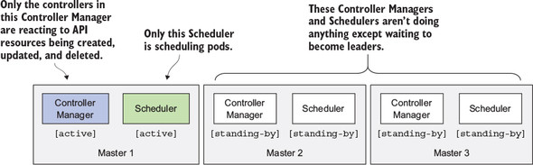

```
$ kubectl describe endpoints kube-scheduler -n kube-system
Name:         kube-scheduler
Namespace:    kube-system
Labels:       <none>
Annotations:  control-plane.alpha.kubernetes.io/leader:
                {"holderIdentity":"k8s-master_3828400c-4eab-11e9-b23d-0800271eafb6","leaseDurationSeconds":15,"acquireTime":"2019-03-25T03:08:36Z","renewT...
Subsets:
Events:  <none>
```

```
$ curl http://localhost:8080/api/v1/namespaces/kube-system/endpoints?watch=true
```
</div>