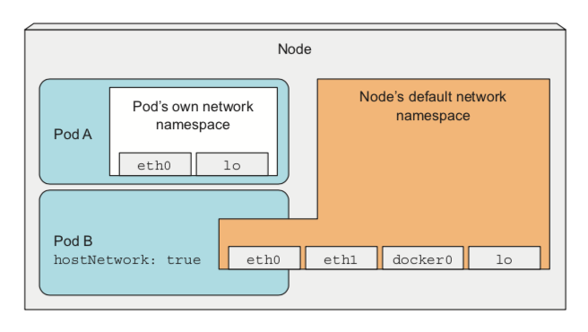
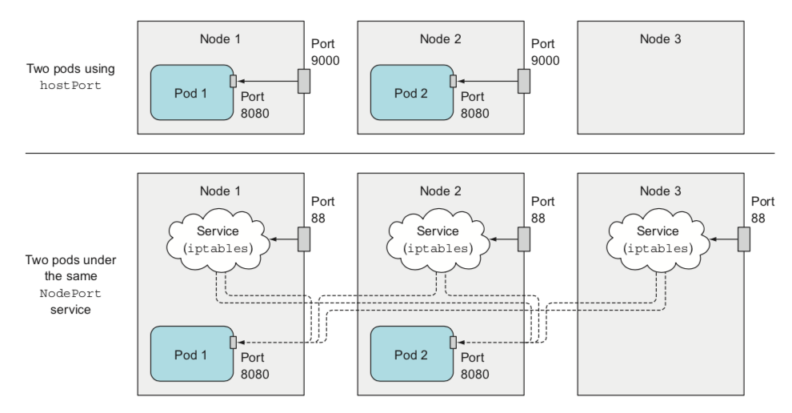
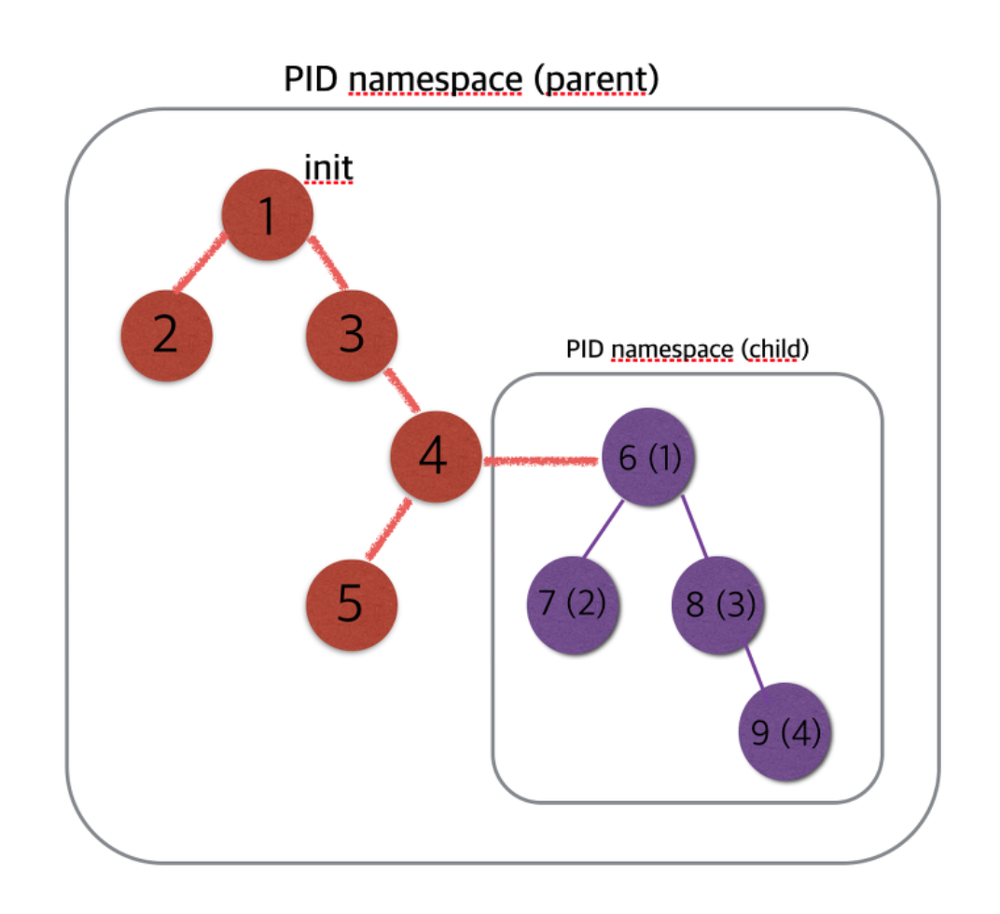
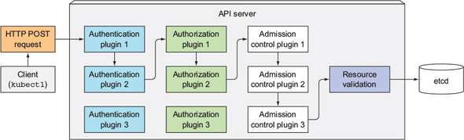

# Chapter 13

# Securing cluster nodes and the network
- kubernetes를 활용해 production workload를 구성할 경우 cluster manager와 application 개발자간의 협업을 통해 실제 application logic이 container 환경으로 배포된다.
- application 개발자: application logic을 구현하고 docker image를 만들고 kubernetes resource(deployment, pod, demonSet, StatefulSet, ..)을 만든다. 각 container에서 필요한 node의 kernel기능 및 node의 IPC, PID등을 사용할 수 있도록 명세할 수도 있다. 뿐만아니라 해당 container process가 어떤 userId로 실행할지를 명세할 수 있다.
- cluster manager: PSP(PodSecurityPolicy), NetworkPolicy등 cluster level에서 container process의 기능을 제한하고 pod간 networking을 통제한다.

## contents
- application 개발자 입장에서의 container process 기능 확장 및 제한 
- cluster manager 입장에서의 cluster 보안


---

### linux namespace :: 동일 system내에서 독립된 공간을 사용하는 것처럼 격리된 환경을 제공하는 lightweight 가상화 기술.
  - UTS namespace : hostname 을 변경하고 분할
  - IPC namespace : Inter-process communication. 프로세스간 통신 격리
  - PID namespace : PID (Process ID)를 분할 관리
  - NS namepsace : file system 의 mount 지점을 분할하여 격리
  - NET namespace : Network interface, iptables 등 network 리소스와 관련된 정보를 분할
  - USER namespace : user와 group ID를 분할 격리

> pod내의 container는 node의 기본 namespace에서 실행중인 process와 다른 namespace의 process에서 실행
>  - NET namespace -> 자체 ip 및 port공간
>  - PID namespace -> 고유한 process tree  
>  - IPC namespace -> 동일한 pod process 사이에만 IPC 가능

## pod내에서 node namespace 사용

### pod이 구동중인 node의 NET interface 사용하기

```yaml
apiVersion: v1
kind: Pod
metadata:
  name: alpine
spec:
  hostNetwork: true
  containers:
  - name: main
    image: express:1
```
- pod내의 container가 host network namespace를 사용
- container 환경에선 veth interface(pair interface)를 활용해 외부와 통신. 즉, 내부 process에선 외부 network adpater를 볼 수 없다. -> host의 network interface를 사용하므로 실제 host network adpater를 볼 수 있다.
- kubernetes master의 component가 pod으로 배포됬을 때 ```hostNetwork```를 통해 실제로 pod으로 실행되지 않는 것처럼 효율적으로 동작

### host NET namespace를 사용하지 않고 host port에 binding
- container NET interface를 가진 상태에서 node의 기본 namespace에 있는 port에 binding
```yaml
apiVersion: v1
kind: Pod
metadata:
  name: express-app
spec:
  containers:
  - image: express:1
    name: main
    ports:
    - containerPort: 4000
      hostPort: 9000
      protocol: TCP
```
- host port에 binding하는 방법
  - hostPort
  - service를 통한 NodePort



- hostPort vs NodePort
  - 공통점
    - 2개의 process가 동일한 host port에 binding될 수 없다 -> 이미 binding된 process가 있을  때 배포시 pending
  - 차이점
    - hostPort의 경우 배포된 node의 iptables에만 등록
    - NodePort로 배포된 경우 모든 node의 iptables에 등록

> ### Configuration Best Practices  
> Don’t specify a hostPort for a Pod unless it is absolutely necessary. When you bind a Pod to a hostPort, it limits the number of places the Pod can be scheduled, because each <hostIP, hostPort, protocol> combination must be unique. If you don’t specify the hostIP and protocol explicitly, Kubernetes will use 0.0.0.0 as the default hostIP and TCP as the default protocol.

### node IPC, PID namespace 사용
```yaml
apiVersion: v1
kind: Pod
metadata:
  name: express-app
spec:
  hostPID: true
  hostIPC: true
  containers:
  - name: main
    image: nodeapp:2
```

- linux에서는 모든 process들이 각각의 고유한 process id(PID)를 가진다. kernel은 이 process들을 tree형태로 관리하는데 이는 parent-child hierarchy를 가진다는 것을 의미한다.
- hostPID를 가진다는 의미는 host에서 실행중인 모든 process들을 볼 수 있다는 의미이다.
- hostIPC를 통해 pod container process가 node에서 실행 중인 다른 모든 process와 통신할 수 있다.

```sh
# PID, IPC 적용 전
$ kubectl exec express-app ps aux
PID   USER     TIME  COMMAND
    1 root      0:00 npm
   18 root      0:00 node app.js
   35 root      0:00 ps aux

----------------------------------------

# PID, IPC 적용 후
$ kubectl exec express-app ps aux
PID   USER     TIME  COMMAND
    1 root      0:02 /sbin/init text
    2 root      0:00 [kthreadd]
    3 root      0:01 [ksoftirqd/0]
    5 root      0:00 [kworker/0:0H]
    7 root      0:17 [rcu_sched]
    8 root      0:00 [rcu_bh]
    9 root      0:00 [migration/0]
   10 root      0:00 [lru-add-drain]
...
```

## container securityContext 설정
- securityContext를 통해 pod과 container 보안 관련 기능을 설정할 수 있다.
  - container process에서 실행할 수 있는 userId 지정
  - container가 root로 실행되는 것 방지
  - container가 privileged mode로 시행해 node의 kernel에 대한 full access권한 부여
  - container process에게 개별 kernel 기능 추가 & 삭제
  - SELinux(Security Enhanced Linux) option
  - process가 container file system에 쓰지 못하게 하기
```yaml
# pod level에서의 securityContext
apiVersion: v1
kind: Pod
metadata:
  name: express-app
spec:
  securityContext:
    runAsUser: 405 # guest user
  containers:
  - name: nginx-container
    image: nginx
  - image: express:3
    name: main
    ports:
    - containerPort: 4000
      hostPort: 9000
      protocol: TCP

# container level에서의 securityContext
apiVersion: v1
kind: Pod
metadata:
  name: express-app
spec:
  securityContext:
    runAsUser: 405 # guest user
  containers:
  - image: express:3
    name: main
    ports:
    - containerPort: 4000
      hostPort: 9000
      protocol: TCP
```
- securityContext는 pod level과 container level에서 작성할 수 있으며 pod level에서 작성시 pod에 구동되는 모든 container에 적용되고 container level에서 override 할 수 있다.

```yaml
apiVersion: v1
kind: Pod
metadata:
  name: security-context-demo
spec:
  securityContext:
    runAsNonRoot: true                              # root user로 실행 방지 ()
    fsGroup: 2000                                   # mount된 volume 소유그룹
    supplementalGroups: [666, 777]                  # user 추가 그룹
  volumes:
  - name: sec-ctx-vol
    emptyDir: {}
  containers:
  - name: nginx
    image: nginx
    securityContext:
      runAsUser: 1000                               # 특정 userId로 container 실행
      privileged: true                              # privileged mode로 실행
      capabilities:                                 #
        add:
        - SYS_TIME
        drop:
        - CHOWN
  - name: sec-ctx-demo
    image: gcr.io/google-samples/node-hello:1.0
    volumeMounts:
    - name: sec-ctx-vol
      mountPath: /data/demo
    securityContext:
      runAsUser: 2000                               # 특정 userId로 container 실행
      allowPrivilegeEscalation: false
      readOnlyRootFilesystem: true
```
- ```runAsNonRoot: true```일 경우 docker image가 root로 실행된다면 pod container 생성 오류가 난다.
```sh
$ kubectl get po
NAME          READY     STATUS                       RESTARTS   AGE
express-app   0/1       CreateContainerConfigError   0          24s

$ kubectl describe po express-app
...
Events:
  Type     Reason                 Age                From                         Message
  ----     ------                 ----               ----                         -------
  Normal   Scheduled              57s                default-scheduler            Successfully assigned express-app to docker-for-desktop
  Normal   SuccessfulMountVolume  56s                kubelet, docker-for-desktop  MountVolume.SetUp succeeded for volume "default-token-gqvh5"
  Normal   SandboxChanged         51s (x2 over 54s)  kubelet, docker-for-desktop  Pod sandbox changed, it will be killed and re-created.
  Normal   Pulled                 11s (x8 over 55s)  kubelet, docker-for-desktop  Container image "express:2" already present on machine
  Warning  Failed                 11s (x8 over 55s)  kubelet, docker-for-desktop  Error: container has runAsNonRoot and image will run as root
```

--- 

## pod 보안 관련 기능 사용 제한
- PSP(PodSecurityPolicy)를 통해 pod의 보안 관련 기능에 대한 사용을 제한할 수 있다.

- PSP는 master node의 API server에서 PodSecurityPolicy admission control plugin에 의해 수행된다.
  - api server로 pod resource가 배포될 때 PodSecurityPolicy admission control plugin에 의해 구성된 PodSecurityPolicy들을 기반으로 유효성 검사를 한다.
  - plugin은 정책에 구성된 default 값을 바탕으로 pod resource를 수정한다.
  - pod을 새로 생성하거나 update할 때 반영되므로 기존에 배포된 pod에는 영향을 미치지 않는다.
- non-namespace resource로 RBAC 메커니즘을 통해 특정 사용자 또는 그룹에 clusterRole을 지정해 PSP admission control plugin을 적용시킬 수 있다.

### PodSecurityPolicy
- pod이 IPC, PID or hostNetwork를 사용할 수 있는지 여부
- pod이 binding할 수 있는 host port
- container가 실행 할 수 있는 userId
- container가 실핼 할 수 있는 fsGroup
- pod를 privileged mode로 실행할 수 있는지 여부
- default securityContext의 capabilities
- pod이 사용할 수 있는 volume type

- container가 사용할 수 있는 SELinux label
- container가 쓰기 가능한 root file system을 사용할 수 있는지 여부

```yaml
apiVersion: extensions/v1beta1
kind: PodSecurityPolicy
metadata:
  name: default
spec:
  hostIPC: false                # host IPC 사용 x
  hostPID: false                # host PID 사용 x
  hostNetwork: false            # host network interface 사용 x
  hostPorts:                    # 1000 ~ 11000, 13000 ~ 14000 port만 사용
  - min: 10000
    max: 11000
  - min: 13000
    max: 14000
  privileged: false             # 권한모드 x
  readOnlyRootFilesystem: true  # root file system에 쓰기 x
  runAsUser:                    # userId 405
    rule: 'MustRunAs'
    ranges:
    - min: 405
      max: 405
  fsGroup:                      # any fsGroup
    rule: RunAsAny
  supplementalGroups:           
    rule: RunAsAny
  seLinux:                      # any SELinux group
    rule: RunAsAny
  volumes:                      # any volume
  - emptyDir
  - configMap
  - secret
  - downwardAPI
  - persistentVolumeClaim
```

> PodSecurityPolicy는 pod 배포시 api server단에서 resource yaml을 검사하는 것이므로 pod의 securityContext에 명시된 runAsUser가 policy가 허용한 범위내의 userId가 아닌경우 배포가 차단되지만 Dockerfile에 명시된 user인 경우 검사하지 못한다. 만약 policy에 min, max값을 동일하게 해서 특정 userId로 실행하도록 설정되어 있다면 Dockerfile에 명신된 USER를 override해서 실행한다.

### linux capabilities 제어
- PodSecurityPolicy의 ```allowedCapabilities, defaultAddCapabilities, requiredDropCapabilities```를 통해 pod의 securityContext의 capabilities를 제어할 수 있다.
```yaml
apiVersion: extensions/v1beta1
kind: PodSecurityPolicy
spec:
  allowedCapabilities:
  - SYS_TIME
  defaultAddCapabilities:
  - CHOWN
  requiredDropCapabilities:
  - SYS_ADMIN
  - SYS_MODULE
...
```
- allowedCapabilities: securityContext.capabilities.add에 추가할 수 있는 기능들의 지정 (선택지)
- defaultAddCapabilities: securityContext.capabilities에 default로 추가된다.
  - 만약 해당 container에서 기능을 가지기를 원하지 않으면 명시적으로 기능을 제거해야 한다.
- requireDropCapabilities: securityContext.capabilities.drop에 자동으로 추가
  - securityContext.capabilities.add에 해당 기능들을 명시한다면 실행을 거부한다.

### PodSecurityPolicy with RBAC

## pod network 분리
- ingress 정책
  - podSelector로 특정 pod만 허용
  - namespaceSelector로 특정 ns의 모든 pod 허용
  - CIDR를 통해 해당 ip 대역 pod 허용
```yaml
apiVersion: networking.k8s.io/v1
kind: NetworkPolicy
metadata:
  name: postgres-netpolicy
spec:
  podSelector:
    matchLabels:
      app: database
  ingress:
  - from:
    - podSelector:
        matchLabels:
          app: webserver
    ports:
    - port: 5432
```
```yaml
apiVersion: networking.k8s.io/v1
kind: NetworkPolicy
metadata:
  name: shoppingcart-netpolicy
spec:
  podSelector:
    matchLabels:
      app: shopping-cart
  ingress:
  - from:
    - namespaceSelector:
        matchLabels:
          tenant: manning
    ports:
    - port: 80
```
```yaml
apiVersion: networking.k8s.io/v1
kind: NetworkPolicy
metadata:
  name: shoppingcart-netpolicy
spec:
  podSelector:
    matchLabels:
      app: shopping-cart
  ingress:
  - from:
    - ipBlock:
        cidr: 192.168.1.0/24
```

- egress 정책
```yaml
apiVersion: networking.k8s.io/v1
kind: NetworkPolicy
metadata:
  name: egress-policy
spec:
  podSelector:
    matchLabels:
      app: webserver
egress: 
- to:
  - podSelector:
    matchLabels:
      app: database
```