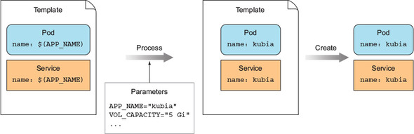
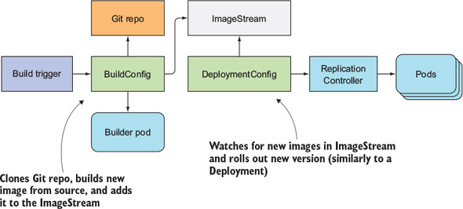
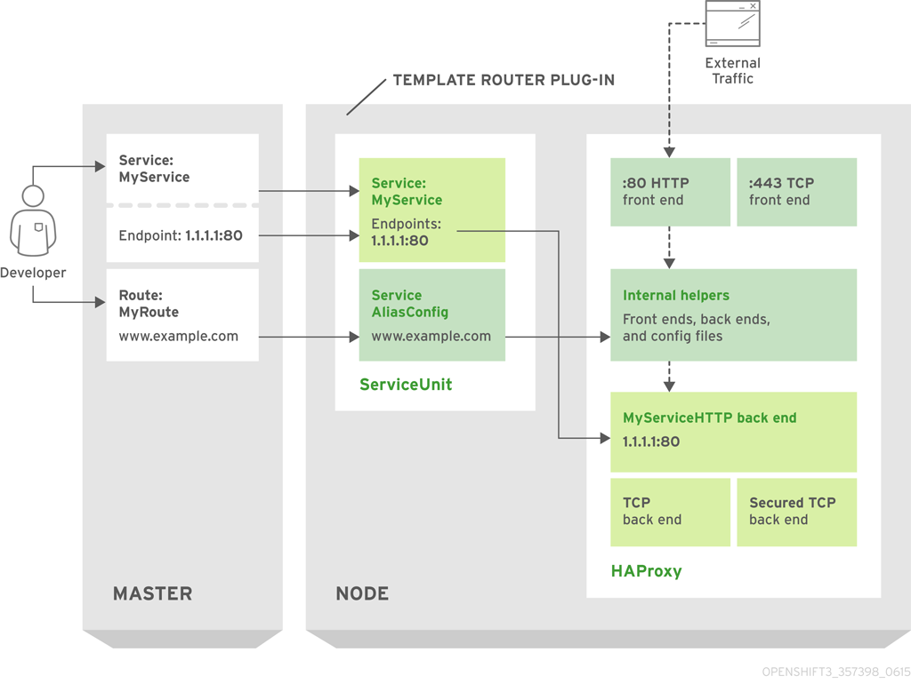
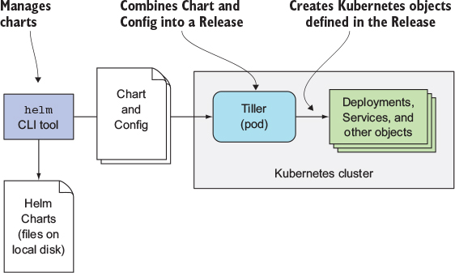

<!-- $theme: gaia -->
<!-- template: invert -->
<!-- page_number:true -->
<!-- $size: 16:9 -->

# Chapter 18-3
# 쿠버네티스 기반 플랫폼

-----------------------------------------

<div style="font-size:75%">

## RedHat OpenShift Container Platform

* OpenShift v1,2는 k8s와 관련이 없었지만, v3에서 k8s로 새로 빌드.
* 추가적인 Resource 제공.
* 네트워크까지 격리된 Multi-Tenant 환경 제공.

</div>

-----------------------------------------

<div style="font-size:75%">
  
## 사용자, 그룹, 프로젝트의 이해

* 강력한 사용자 관리 기능을 기종.
* 각 사용자가 수행할 수 있거나 수행할 수 없는 작업을 지정 가능.
* 각 사용자는 특정 프로젝트에 엑세스 가능.
* Project는 K8S Namespace Resource에 추가 Annotations로 구현.
* Project의 접근 권한은 클러스터 관리자가 부여.

</div>

--------------------------------------

<div style="font-size:75%">

## Application Template

* K8S는 단일 매니페스트를 통해 리소스를 배포.
* OpenShift는 이 매니페스트를 매개변수화 할 수 있게 지원.
* 매개 변수화 가능한 목록이 Template.
* OpenShift는 Pre-Defined된 Template을 제공하여, 몇 가지 인수를 지정하면 복잡한 Application을 신속하게 배포할 수 있도록 지원.



</div>

--------------------------------------

<div style="font-size:75%">
  
## Application Template

```
# redis-template.yaml

apiVersion: v1
kind: Template
metadata:
  name: redis-template
  annotations:
    description: "Description"
    iconClass: "icon-redis"
    tags: "database,nosql"
objects:
- apiVersion: v1
  kind: Pod
  metadata:
    name: redis-master
  spec:
    containers:
    - env:
      - name: REDIS_PASSWORD
        value: ${REDIS_PASSWORD}
      image: dockerfile/redis
      name: master
      ports:
      - containerPort: 6379
        protocol: TCP
parameters:
- description: Password used for Redis authentication
  from: '[A-Z0-9]{8}'
  generate: expression
  name: REDIS_PASSWORD
labels:
  redis: master
```

</div>

--------------------------------------

<div style="font-size:75%">

## Application Template

```
$ oc process -f redis-template.yaml -p REDIS_PASSWORD=PASSWORD | oc create -f -

or

$ oc process -f redis-template.yaml --param-file=redis.env | oc create -f -
```

</div>

--------------------------------------

<div style="font-size:75%">

## BuildConfigs

* 해당 리소스를 작성하여 소스 코드로부터 이미지를 자동 생성.
* Source To Image(S2I)
	* 소스 코드를 입력으로 사용하여 이미지를 쉽게 작성 및 생성하는 프레임워크
	* Build Process
		* Sources
		* S2I Scripts
		* Builder Image

</div>

--------------------------------------

<div style="font-size:75%">

## BuildConfigs

```
kind: "BuildConfig"
apiVersion: "v1"
metadata:
  name: "ruby-sample-build" 
spec:
  runPolicy: "Serial" 
  triggers: 
    -
      type: "GitHub"
      github:
        secret: "secret101"
    - type: "Generic"
      generic:
        secret: "secret101"
    -
      type: "ImageChange"
  source: 
    git:
      uri: "https://github.com/openshift/ruby-hello-world"
  strategy: 
    sourceStrategy:
      from:
        kind: "ImageStreamTag"
        name: "ruby-20-centos7:latest"
  output: 
    to:
      kind: "ImageStreamTag"
      name: "origin-ruby-sample:latest"
  postCommit: 
      script: "bundle exec rake test"
```

</div>

--------------------------------------

<div style="font-size:75%">

## DeploymentConfig

* 새 컨데이너 이미지가 생성되면 자동으로 클러스터에 배치



</div>

--------------------------------------

<div style="font-size:75%">

## Route

* Domain Name으로 Service를 노출시킴으로써 외부의 Client가 접속할 수 있는 통로 역할을 함(Ingress).
* HAProxy를 이용한 Route가 기본 내장.
* TLS 종료 및 트래픽 분할 등 추가 구성을 제공.


</div>

--------------------------------------

<div style="font-size:75%">

## Route



</div>

--------------------------------------

<div style="font-size:75%">

## Deis Workflows (Hephy)

* Kubernetes의 Eco-System.
* PaaS.
* Kubernetes에 Application을 쉽게 배포하고 관리할 수 있도록 지원.

</div>

--------------------------------------

<div style="font-size:75%">

## Helm

* Kubernetes의 패키지 관리자 (yum, apt, brew)
* Cli(client), Tiller(k8s 내에서 pod으로 실행)로 구성



</div>

--------------------------------------

<div style="font-size:75%">

## Helm

* directory tree

```
so-vfc-adapter:
  Chart.yaml
  resources:
    config:
      overrides:
        override.yaml
  templates:
    configmap.yaml
    deployment.yaml
    service.yaml
  values.yaml
```

</div>

--------------------------------------

<div style="font-size:75%">

## Helm

* templates/service.yaml

```
apiVersion: v1
kind: Service
metadata:
  name: {{ include "common.servicename" . }}
  namespace: {{ include "common.namespace" . }}
  labels:
    app: {{ include "common.name" . }}
    chart: {{ .Chart.Name }}-{{ .Chart.Version | replace "+" "_" }}
    release: {{ .Release.Name }}
    heritage: {{ .Release.Service }}
spec:
  type: {{ .Values.service.type }}
  ports:
    {{if eq .Values.service.type "NodePort" -}}
    - port: {{ .Values.service.internalPort }}
      nodePort: {{ .Values.global.nodePortPrefix | default .Values.nodePortPrefix }}{{ .Values.service.nodePort }}
      name: {{ .Values.service.portName }}
    {{- else -}}
    - port: {{ .Values.service.externalPort }}
      targetPort: {{ .Values.service.internalPort }}
      name: {{ .Values.service.portName }}
    {{- end}}
  selector:
    app: {{ include "common.name" . }}
    release: {{ .Release.Name }}
```

</div>

--------------------------------------

<div style="font-size:75%">

## Helm

* values.yaml

```
#################################################################
# Global configuration defaults.
#################################################################
global:
  nodePortPrefix: 302
  nodePortPrefixExt: 304
  repository: nexus3.onap.org:10001
  readinessRepository: oomk8s
  readinessImage: readiness-check:2.0.0
  persistence:
    mountPath: /dockerdata-nfs

#################################################################
# Application configuration defaults.
#################################################################
repository: nexus3.onap.org:10001
image: onap/so/vfc-adapter:1.3.3
pullPolicy: Always

replicaCount: 1
minReadySeconds: 10
containerPort: 8084
logPath: ./logs/vfc/
app: vfc-adapter
service:
  type: ClusterIP
  internalPort: 8084
  externalPort: 8084
  portName: so-vfc-port
updateStrategy:
  type: RollingUpdate
  maxUnavailable: 1
  maxSurge: 1
# Resource Limit flavor -By Default using small
flavor: small
# Segregation for Different environment (Small and Large)
resources:
  small:
    limits:
      memory: 4Gi
      cpu: 2000m
    requests:
      memory: 1Gi
      cpu: 500m
  large:
    limits:
      memory: 8Gi
      cpu: 4000m
    requests:
      memory: 2Gi
      cpu: 1000m
  unlimited: {}
livenessProbe:
  path: /manage/health
  port: 8084
  scheme: HTTP
  initialDelaySeconds: 600
  periodSeconds: 60
  timeoutSeconds: 10
  successThreshold: 1
  failureThreshold: 3
mariadb:
  nameOverride: so-mariadb
ingress:
  enabled: false
nodeSelector: {}
tolerations: []
affinity: {}
```

</div>